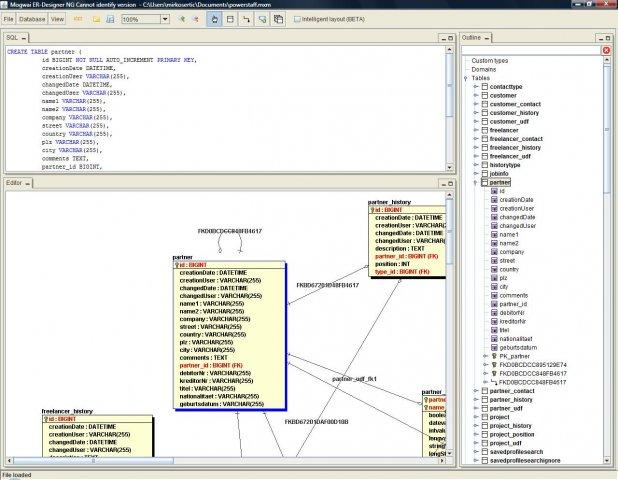
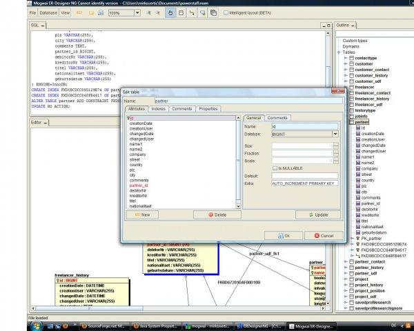
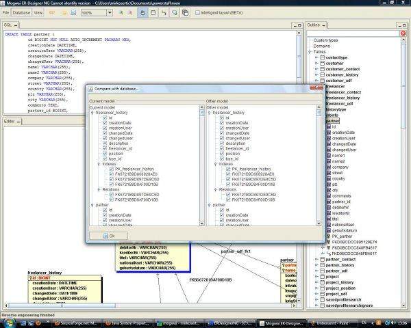
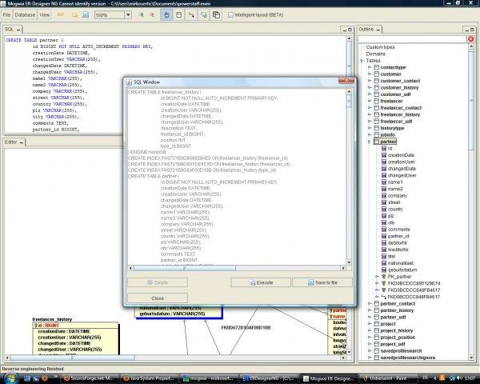
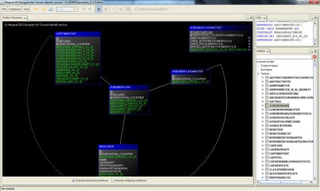
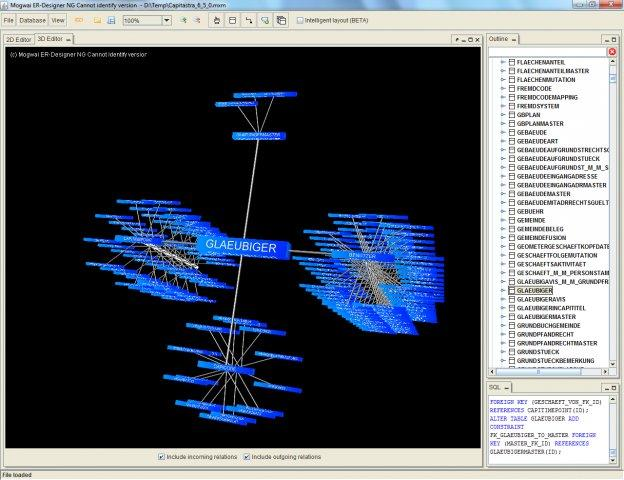

# Mogwai ERDesigner NG

The Mogwai ERDesigner is an entity relationship modeling/design tool(ERD) such as ERWin and co. The only difference is that it is Open Source and does not cost anything. It was designed to make database modeling as easy as it can be and to support the developer in the whole development process, from database design to schema and code generation.

Build status 

Releases are available [at GitHub](https://github.com/mirkosertic/MogwaiERDesignerNG/releases) or

[](https://www.microsoft.com/en-us/p/erdesigner-ng/9mz4zgjc5rj3)

**ERDesigner NG**
* is based on Java and can be run on Windows,Unix and Mac systems
* is distributed as a zip/tar/installer file or can be launched by Microsoft Store
* has a powerful WYSIWYG editor for physical database design
* supports 2D and 3D database modeling, browsing and design
* generates true 3D anaglyphic views from your database structure
* handles tables, relations, views, domains, custom types, indexes and comments
* supports a central repository for all models ( Model Repository )
* supports subject areas
* supports MySQL, Oracle, Microsoft SQLServer, PostgreSQL, H2 and HypersonicSQL
* creates the SQL DDL statements for your database schema
* supports forward and reverse engineering
* has an integrated schema version control system
* can generate schema migration scripts for every change
* stores the database definition as XML files for further processing
* can export the database schema as GIF, BMP, JPEG or SVG files
* has an integrated reverse engineering module for existing schemas
* has a build in schema compare feature
* can generate schema documentation as PDF, HTML, RTF and other formats
* supports schema conversion between different dialects
* analyzes the database model for common problems
* generates [OpenXava](https://www.openxava.org/) applications
* it is based on GPL license

## User manual

An extensive user manual is available [here](userdoc/MogwaiERDesignerNG.pdf).

## Building from source
You need to install java version 14 inorder to build project.
```bash
wget https://download.java.net/java/GA/jdk14.0.2/205943a0976c4ed48cb16f1043c5c647/12/GPL/openjdk-14.0.2_linux-x64_bin.tar.gz
tar -xvzf openjdk-14.0.2_linux-x64_bin.tar.gz
sudo mv jdk-14.0.2 /usr/lib/jvm/jdk-14
export JAVA_HOME=/usr/lib/jvm/jdk-14                                         
export PATH=$JAVA_HOME/bin:$PATH
```
Install apache maven.
```
sudo yum install maven # redhat
sudo apt install maven # debian
```

Build project and create release package:
```bash
mvn clean package -DskipDeb  # redhat
mvn clean package -DskipRpm  # debian
```
Packaged release file will be created in `target/release`.
You can use it to install app system-wide.

To run app without installing it:
```bash
cd target/staging
bash run.sh # linux
bash run.bat  # windows
```

## Screenshots

### Main Screen


### Edit table


### Model compare


### SQL generation


### 2D editing mode


### 3D editing mode
